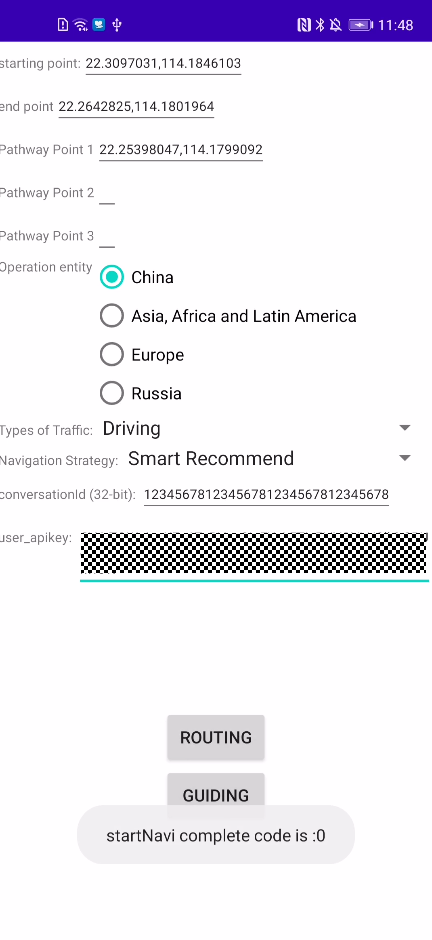

Android版导航服务示例代码
===============================

中文 | [English](README.md)

## 目录

* [简介](#简介)
* [开发准备](#开发准备)
* [环境要求](#环境要求)
* [结果](#结果)
* [技术支持](#技术支持)
* [授权许可](#授权许可)

简介
-------

导航服务（Navi Kit）为您提供了一套导航开发调用的SDK，方便您轻松地在应用中集成导航相关的功能，全方位提升用户体验。

Navi Kit的主要包含如下5大功能：
- 更丰富的导航方式：支持驾车、步行、骑行、公交的智能路线规划，轻松避开拥堵、限行和难走路段，导航中为您实时推荐更快、更准确、更安全的路线。
- 更细节的信息引导：全屏车道级引导和路口放大图，帮助您在复杂路口前提前感知变道，不错过每一个关键路口。
- 更及时的驾驶提醒：实时获取路段的限速值、违章摄像头情况、拥堵情况、道路突发事件，及时作出提醒，为您提供全方位护航。用户也可通过自主上报获得更加实时、精准的导航服务。
- 更精准的路网监测：实时监测平行的主辅路和重叠的桥上桥下道路场景。
- 更直观的3D道路图层：力求将道路及道路周边的建筑1：1还原，帮助您在驾驶过程中更加轻松舒适。

该示例也可以通过HMS Toolkit快速启动运行，且支持各Kit一站式集成，并提供远程真机免费调测等功能。了解更多信息，请参考[HMS Toolkit官方链接](https://developer.huawei.com/consumer/cn/doc/development/Tools-Guides/getting-started-0000001077381096?ha_source=hms1)。

开发准备
-------

我们提供一个示例展示如何使用安卓版华为导航服务SDK。

该示例使用Gradle编译系统。

首先通过克隆该仓库或者下载压缩包的方式来下载示例代码。

在Android Stuido中，选择Open an existing Android Studio project，然后选择navi-sample文件所在的目录。

你可以使用gradlew build命令来直接编译项目。

你应该在AppGallery Connect中创建一个应用，获取agconnect-services.json文件并将其加入到你的项目中。你还应生成一个签名证书指纹，将证书文件添加到你的项目中，并在build.gradle文件中添加配置。参见“[配置AppGallery Connect](https://developer.huawei.com/consumer/cn/doc/development/HMSCore-Guides/android-sdk-config-agc-0000001050158579)”在AppGallery Connect配置应用信息。

更多开发详情，请参见如下链接：
- [开发指南]()
- [接口参考]()

环境要求
-------

+ JDK 1.8及以上
+ 安装Android Studio 3.6.1及以上
+ minSdkVersion 19及以上
+ targetSdkVersion 31（推荐）
+ compileSdkVersion 31（推荐）
+ Gradle 5.6.4及以上（推荐）
+ Android Gradle插件 3.6.0及以上测试应用的设备：EMUI 5.0及以上的华为手机、平板或Android 7.0 ~ 12的非华为手机。

## 结果

  

## 技术支持

如果您对HMS Core还处于评估阶段，可在[Reddit社区](https://www.reddit.com/r/HMSCore/)获取关于HMS Core的最新讯息，并与其他开发者交流见解。

如果您对使用HMS示例代码有疑问，请尝试：
- 开发过程遇到问题上[Stack Overflow](https://stackoverflow.com/questions/tagged/huawei-mobile-services?tab=Votes)，在**huawei-mobile-services**标签下提问，有华为研发专家在线一对一解决您的问题。
- 到[华为开发者论坛](https://developer.huawei.com/consumer/cn/forum/blockdisplay?fid=18?ha_source=hms1) HMS Core板块与其他开发者进行交流。

如果您在尝试示例代码中遇到问题，请向仓库提交[issue](https://github.com/HMS-Core/hms-navikit-demo-java/issues)，也欢迎您提交[Pull Request](https://github.com/HMS-Core/hms-navikit-demo/pulls)。

## 授权许可
-------
华为导航服务示例代码经过[Apache License 2.0](https://github.com/HMS-Core/hms-navikit-demo-java/blob/master/LICENSE)授权许可。